# Teste 04 - dataset 08 CTU - 22 abr 2020
## Carregando os dados usando PANDAS


```python
import pandas as pd
data = pd.read_csv("capture20110816-3.binetflow") #dataset 08 do CTU
data['Label'] = data.Label.str.contains("Botnet")
```

## Verificando colunas


```python
data.columns
```


    Index(['StartTime', 'Dur', 'Proto', 'SrcAddr', 'Sport', 'Dir', 'DstAddr',
           'Dport', 'State', 'sTos', 'dTos', 'TotPkts', 'TotBytes', 'SrcBytes',
           'Label'],
          dtype='object')


### Depois de rodar o arquivo de Chebbi para gerar o arquivo Pickle
### Treinar e testar modelos
#### Carregar o arquivo Pickle, importar sua biblioteca e o arquivo de preparação dos dados:


```python
import pickle, warnings
from lib import LoadData, DataPreparation
#arquivo LoadData dado pelo git do livro Mastering Machine Learning for Penetration Testing com adaptações 
#para preparar os dados do netflow e gerara o arquivo Pickle
```


```python
warnings.filterwarnings("ignore")
LoadData.loaddata('flowdata.csv')
file = open('flowdata.pickle', 'rb')
data = pickle.load(file)
```

# Visualizando os dados
#### Imprimindo as 5 primeiras linhas


```python
dados = pd.read_csv('flowdata.csv')
dados.head(5)
```


<div>
<style scoped>
    .dataframe tbody tr th:only-of-type {
        vertical-align: middle;
    }

    .dataframe tbody tr th {
        vertical-align: top;
    }

    .dataframe thead th {
        text-align: right;
    }
</style>
<table border="1" class="dataframe">
  <thead>
    <tr style="text-align: right;">
      <th></th>
      <th>Dur</th>
      <th>SrcAddr</th>
      <th>DstAddr</th>
      <th>Proto</th>
      <th>TotBytes</th>
      <th>Sport</th>
      <th>Dport</th>
      <th>Label</th>
      <th>Rand</th>
    </tr>
  </thead>
  <tbody>
    <tr>
      <th>0</th>
      <td>64.691492</td>
      <td>59.152.9.237</td>
      <td>192.168.137.85</td>
      <td>TLSv1.2</td>
      <td>1434</td>
      <td>443</td>
      <td>36674</td>
      <td>Botnet</td>
      <td>0.000010</td>
    </tr>
    <tr>
      <th>1</th>
      <td>35.507096</td>
      <td>192.168.137.85</td>
      <td>23.20.239.12</td>
      <td>TCP</td>
      <td>66</td>
      <td>50376</td>
      <td>80</td>
      <td>Botnet</td>
      <td>0.000037</td>
    </tr>
    <tr>
      <th>2</th>
      <td>1.446011</td>
      <td>192.168.137.87</td>
      <td>158.69.127.66</td>
      <td>TCP</td>
      <td>94</td>
      <td>36387</td>
      <td>443</td>
      <td>Normal</td>
      <td>0.000040</td>
    </tr>
    <tr>
      <th>3</th>
      <td>13.746650</td>
      <td>192.168.137.87</td>
      <td>158.69.127.66</td>
      <td>TCP</td>
      <td>94</td>
      <td>36387</td>
      <td>443</td>
      <td>Normal</td>
      <td>0.000138</td>
    </tr>
    <tr>
      <th>4</th>
      <td>59.843635</td>
      <td>192.168.137.85</td>
      <td>59.152.9.237</td>
      <td>TCP</td>
      <td>86</td>
      <td>36674</td>
      <td>443</td>
      <td>Botnet</td>
      <td>0.000214</td>
    </tr>
  </tbody>
</table>
</div>


Medidas básicas de cada variável: média, desvio padrão, os maiores, menores valores....


```python
print(dados.shape)
print(dados.describe())
```

    (30912, 9)
                    Dur      TotBytes         Sport         Dport          Rand
    count  30912.000000  30912.000000  30912.000000  30912.000000  30912.000000
    mean      43.420742    680.102258  20306.316156  20456.781056      0.499889
    std       38.753540    661.671271  21047.772089  20104.491722      0.289303
    min        0.000000      4.000000      5.000000      6.000000      0.000010
    25%        8.126514     74.000000    443.000000    443.000000      0.246785
    50%       40.780623     94.000000    443.000000  36387.000000      0.501289
    75%       66.647919   1434.000000  36674.000000  36674.000000      0.752081
    max      235.142304   1434.000000  65114.000000  65114.000000      0.999988


```python
#Dur	SrcAddr	DstAddr	Proto	TotBytes	Sport	Dport	Label	Rand
sns.pairplot(dados, hue = 'Label', vars = ['TotBytes', 'Dur', 'Dport', 'Sport'])

```


    <seaborn.axisgrid.PairGrid at 0x7ff31c50b390>


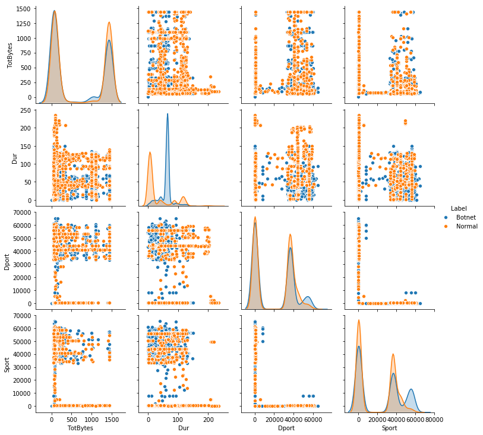


```python
g = sns.FacetGrid(dados, col="Label") 
g.map(sns.distplot, "TotBytes")
```


    <seaborn.axisgrid.FacetGrid at 0x7ff316880e80>


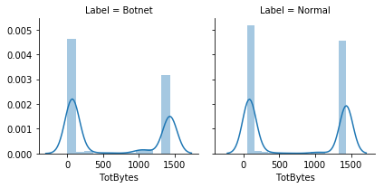


```python
g =sns.scatterplot(x="Proto", y="TotBytes",
              hue="Label",
              data=dados);
```


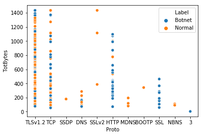


#### Selecionado a seção de dados:


```python
Xdata = data[0]
Ydata = data[1]
XdataT = data[2]
YdataT = data[3]
```

#### Importando módulos para usar os algoritmos de aprendizado de máquina do sklearn:


```python
from sklearn.linear_model import *
from sklearn.tree import *
from sklearn.naive_bayes import *
from sklearn.neighbors import *
from sklearn.svm import SVC

from sklearn.metrics import accuracy_score
from sklearn.metrics import precision_score
from sklearn.metrics import recall_score
from sklearn.metrics import f1_score
from sklearn.discriminant_analysis import LinearDiscriminantAnalysis
from sklearn.ensemble import RandomForestClassifier

import matplotlib.pyplot as plt
```

#### Preparando os dados:


```python
DataPreparation.Prepare(Xdata,Ydata,XdataT,YdataT)
```


    <Prepare(Thread-4, initial)>


```python
from sklearn.datasets import make_blobs

plotX, plotY = Xdata, Ydata

plotX, plotY = make_blobs(n_samples=30000, centers=3,
                  random_state=0, cluster_std=1.0)
plt.scatter(plotX[:, 0], plotX[:, 1], c=plotY, s=50, cmap='rainbow');
plt.title('Scatter plot')
plt.xlabel('X')
plt.ylabel('Y')
plt.show()
```


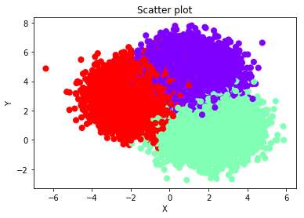


```python

```

### Modelo de Floresta aleatória (Random forest)


```python
clf = RandomForestClassifier()
clf.fit(Xdata,Ydata)

Prediction = clf.predict(XdataT)
escoreRF = clf.score(XdataT,YdataT)
precisaoRF = precision_score(Prediction,YdataT)
recallRF = recall_score(Prediction,YdataT)
acuraciaRF = accuracy_score(Prediction,YdataT)
F1RF=f1_score(Prediction,YdataT)
```

### Modelo de árvore de decisão


```python
clf = DecisionTreeClassifier()
clf.fit(Xdata,Ydata)

Prediction = clf.predict(XdataT)
escoreTree = clf.score(XdataT,YdataT)
precisaoTree = precision_score(Prediction,YdataT)
recallTree = recall_score(Prediction,YdataT)
acuraciaTree = accuracy_score(Prediction,YdataT)
F1Tree=f1_score(Prediction,YdataT)
```

#### Agrupamento de dados no modelo de árvore de decisão 


```python
from lib import helpers_05_08

helpers_05_08.plot_tree_interactive(plotX, plotY);
```


    interactive(children=(Dropdown(description='depth', index=1, options=(1, 5), value=5), Output()), _dom_classes…


#### Visualizando a árvores de decisão


```python
from sklearn.externals.six import StringIO  
from IPython.display import Image  
from sklearn.tree import export_graphviz
import pydotplus

dot_data = StringIO()
export_graphviz(clf, out_file=dot_data,  
                filled=True, rounded=True,
                special_characters=True)

graph = pydotplus.graph_from_dot_data(dot_data.getvalue())  
Image(graph.create_png())
```


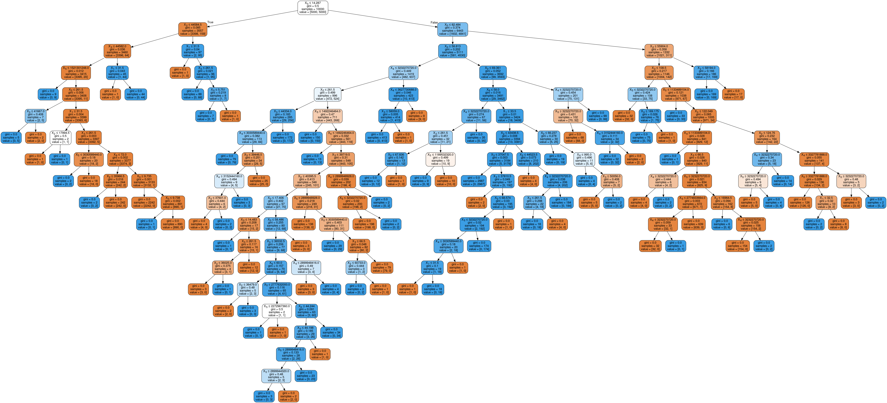


### Modelo de regressão logística


```python
clf = LogisticRegression(multi_class="ovr", C=10000)
clf.fit(Xdata,Ydata)

Prediction = clf.predict(XdataT)
escoreRL = clf.score(XdataT,YdataT)
precisaoRL = precision_score(Prediction,YdataT)
recallRL = recall_score(Prediction,YdataT)
acuraciaRL = accuracy_score(Prediction,YdataT)
F1RL =f1_score(Prediction,YdataT)
```

### Modelo Naive Bayes


```python
clf = GaussianNB()
clf.fit(Xdata,Ydata)

Prediction = clf.predict(XdataT)
escoreNB = clf.score(XdataT,YdataT)
precisaoNB = precision_score(Prediction,YdataT)
recallNB = recall_score(Prediction,YdataT)
acuraciaNB = accuracy_score(Prediction,YdataT)
F1NB =f1_score(Prediction,YdataT)
```


```python
from sklearn.datasets import make_blobs

plt.title('Scatter plot')
plt.xlabel('x')
plt.ylabel('y')
plt.scatter(Xdata[:, 0], Xdata[:, 1], c=Ydata, s=50, cmap='RdYlGn');

```


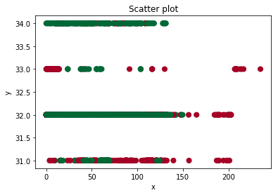


### Modelo k-Nearest


```python
clf = KNeighborsClassifier()
clf.fit(Xdata,Ydata)

Prediction = clf.predict(XdataT)
escoreKN = clf.score(XdataT,YdataT)
precisaoKN = precision_score(Prediction,YdataT)
recallKN = recall_score(Prediction,YdataT)
acuraciaKN = accuracy_score(Prediction,YdataT)
F1KN=f1_score(Prediction,YdataT)

#from sklearn.metrics import classification_report, confusion_matrix
#print(classification_report(YdataT, Prediction))
```

### Modelo de SVC


```python
clf = SVC()
clf.fit(Xdata,Ydata)

Prediction = clf.predict(XdataT)
escoreSVC = clf.score(XdataT,YdataT)
precisaoSVC = precision_score(Prediction,YdataT)
recallSVC = recall_score(Prediction,YdataT)
acuraciaSVC = accuracy_score(Prediction,YdataT)
F1SVC =f1_score(Prediction,YdataT)

```

### Modelo de Análise Discriminante


```python
clf = LinearDiscriminantAnalysis()
clf.fit(Xdata,Ydata)

Prediction = clf.predict(XdataT)
escoreAD = clf.score(XdataT,YdataT)
precisaoAD = precision_score(Prediction,YdataT)
recallAD = recall_score(Prediction,YdataT)
acuraciaAD = accuracy_score(Prediction,YdataT)
F1AD=f1_score(Prediction,YdataT)
```

# ----- Resultados ------

### [+] Acurácia:


```python
print ("Acurácia Floresta aleatória (Random forest): ", acuraciaRF)
print ("Acurácia árvore de decisão: ", acuraciaTree)
print ("Acurácia regressão logística: ", acuraciaRL)
print ("Acurácia Naive Bayes: ", acuraciaNB)
print ("Acurácia k-Nearest: ", acuraciaKN)
print ("Acurácia SVC: ", acuraciaSVC)
print ("Acurácia Análise Discriminante: ", acuraciaAD)
```

    Acurácia Floresta aleatória (Random forest):  0.9979
    Acurácia árvore de decisão:  0.9948
    Acurácia regressão logística:  0.5
    Acurácia Naive Bayes:  0.8226
    Acurácia k-Nearest:  0.9939
    Acurácia SVC:  0.8501
    Acurácia Análise Discriminante:  0.8985


### [+] Escore


```python
print ("Escore Floresta aleatória (Random forest): ", escoreRF * 100)
print ("Escore árvore de decisão: ", escoreTree * 100)
print ("Escore regressão logística: ", escoreRL * 100)
print ("Escore Naive Bayes: ", escoreNB * 100)
print ("Escore k-Nearest: ", escoreKN * 100)
print ("Escore SVC: ", escoreSVC * 100)
print ("Escore Análise Discriminante: ", escoreAD * 100)
```

    Escore Floresta aleatória (Random forest):  99.79
    Escore árvore de decisão:  99.48
    Escore regressão logística:  50.0
    Escore Naive Bayes:  82.26
    Escore k-Nearest:  99.39
    Escore SVC:  85.00999999999999
    Escore Análise Discriminante:  89.85


### [+] Precisão


```python
print ("Precisão Floresta aleatória (Random forest): ", precisaoRF)
print ("Precisão árvore de decisão: ", precisaoTree)
print ("Precisão regressão logística: ", precisaoRL)
print ("Precisão Naive Bayes: ", precisaoNB)
print ("Precisão k-Nearest: ", precisaoKN)
print ("Precisão SVC: ", precisaoSVC)
print ("Precisão Análise Discriminante: ", precisaoAD)
```

    Precisão Floresta aleatória (Random forest):  0.9974
    Precisão árvore de decisão:  0.9956
    Precisão regressão logística:  0.0
    Precisão Naive Bayes:  0.7024
    Precisão k-Nearest:  0.9942
    Precisão SVC:  0.715
    Precisão Análise Discriminante:  0.8808


### [+] Recall (revocação)


```python
print ("Recall Floresta aleatória (Random forest): ", recallRF)
print ("Recall árvore de decisão: ", recallTree)
print ("Recall regressão logística: ", recallRL)
print ("Recall Naive Bayes: ", recallNB)
print ("Recall k-Nearest: ", recallKN)
print ("Recall SVC: ", recallSVC)
print ("Recall Análise Discriminante: ", recallAD)
```

    Recall Floresta aleatória (Random forest):  0.9983983983983984
    Recall árvore de decisão:  0.9940095846645367
    Recall regressão logística:  0.0
    Recall Naive Bayes:  0.9246972090573986
    Recall k-Nearest:  0.9936038376973816
    Recall SVC:  0.979720471362017
    Recall Análise Discriminante:  0.9131246112378187


### [+] F1 score


```python
print ("F1 score Floresta aleatória (Random forest): ", F1RF)
print ("F1 score árvore de decisão: ", F1Tree)
print ("F1 score regressão logística: ", F1RL)
print ("F1 score Naive Bayes: ", F1NB)
print ("F1 score k-Nearest: ", F1KN)
print ("F1 score SVC: ", F1SVC)
print ("F1 score Análise Discriminante: ", F1AD)
```

    F1 score Floresta aleatória (Random forest):  0.9978989494747372
    F1 score árvore de decisão:  0.9948041566746603
    F1 score regressão logística:  0.0
    F1 score Naive Bayes:  0.7983632643782678
    F1 score k-Nearest:  0.9939018294511646
    F1 score SVC:  0.8266851659151347
    F1 score Análise Discriminante:  0.8966710780820524


```python
from prettytable import PrettyTable
    
x = PrettyTable()

x.field_names = ["Modelo", "Acurácia", "Escore", "Precisão", "Recall", "F1 score"]

x.add_row(["Random forest", acuraciaRF, escoreRF * 100, precisaoRF, round(recallRF,3), round(F1RF,3)])
x.add_row(["Árvore de decisão", acuraciaTree,  escoreTree * 100, precisaoTree, round(recallTree,3), round(F1Tree,3)])
x.add_row(["Regressão logística", acuraciaRL, escoreRL * 100, precisaoRL, round(recallRL,3), round(F1RL,3)])
x.add_row(["Naive Bayes", acuraciaNB, escoreNB * 100, precisaoNB, round(recallNB,3), round(F1NB,3)])
x.add_row(["k-Nearest", acuraciaKN, escoreKN * 100, precisaoKN, round(recallKN,3), round(F1KN,3)])
x.add_row(["SVC", acuraciaSVC, round(escoreSVC * 100 ,3), precisaoSVC, round(recallSVC,3), round(F1SVC,3)])
x.add_row(["Análise Discriminante", acuraciaAD, escoreAD * 100, precisaoAD, round(recallAD,3), round(F1AD,3)])

print(x)
```

    +-----------------------+----------+--------+----------+--------+----------+
    |         Modelo        | Acurácia | Escore | Precisão | Recall | F1 score |
    +-----------------------+----------+--------+----------+--------+----------+
    |     Random forest     |  0.9979  | 99.79  |  0.9974  | 0.998  |  0.998   |
    |   Árvore de decisão   |  0.9948  | 99.48  |  0.9956  | 0.994  |  0.995   |
    |  Regressão logística  |   0.5    |  50.0  |   0.0    |  0.0   |   0.0    |
    |      Naive Bayes      |  0.8226  | 82.26  |  0.7024  | 0.925  |  0.798   |
    |       k-Nearest       |  0.9939  | 99.39  |  0.9942  | 0.994  |  0.994   |
    |          SVC          |  0.8501  | 85.01  |  0.715   |  0.98  |  0.827   |
    | Análise Discriminante |  0.8985  | 89.85  |  0.8808  | 0.913  |  0.897   |
    +-----------------------+----------+--------+----------+--------+----------+


#ACERTAR O KERNEL ***********************************************
# import numpy as np
from mpl_toolkits.mplot3d import Axes3D
from sklearn.svm import SVC

clf = SVC(kernel='linear')
clf.fit(Xdata,Ydata)

X, y = Xdata, Ydata

z = lambda x,y: (-clf.intercept_[0]-clf.coef_[0][0]*x-clf.coef_[0][1]*y) / clf.coef_[0][2]

tmp = np.linspace(-2,2,51)
x,y = np.meshgrid(tmp,tmp)

# Plot stuff.
fig = plt.figure()
ax  = fig.add_subplot(111, projection='3d')
ax.plot_surface(x, y, z(x,y))
ax.plot3D(X[Y==0,0], X[Y==0,1], X[Y==0,2],'ob')
ax.plot3D(X[Y==1,0], X[Y==1,1], X[Y==1,2],'sr')
plt.show()#ACERTAR O KERNEL ***********************************************

from sklearn.svm import SVC
import numpy as np
import matplotlib.pyplot as plt
from sklearn import *

X, y = Xdata, Ydata

def make_meshgrid(x, y, h=.02):
    x_min, x_max = x.min() - 1, x.max() + 1
    y_min, y_max = y.min() - 1, y.max() + 1
    xx, yy = np.meshgrid(np.arange(x_min, x_max, h), np.arange(y_min, y_max, h))
    return xx, yy

def plot_contours(ax, clf, xx, yy, **params):
    Z = clf.predict(np.c_[xx.ravel(), yy.ravel()])
    Z = Z.reshape(xx.shape)
    out = ax.contourf(xx, yy, Z, **params)
    return out

model = svm.SVC(kernel='rbf')
clf = model.fit(X, y)

fig, ax = plt.subplots()
# title for the plots
title = ('Decision surface of linear SVC ')
# Set-up grid for plotting.
X0, X1 = X[:, 0], X[:, 1]
xx, yy = make_meshgrid(X0, X1)

plot_contours(ax, clf, xx, yy, cmap=plt.cm.coolwarm, alpha=0.8)
ax.scatter(X0, X1, c=y, cmap=plt.cm.coolwarm, s=20, edgecolors='k')
ax.set_ylabel('y label here')
ax.set_xlabel('x label here')
ax.set_xticks(())
ax.set_yticks(())
ax.set_title(title)
ax.legend()
plt.show()
# [+] Curva de aprendizado


```python
# Load libraries
import numpy as np
import matplotlib.pyplot as plt
from sklearn.model_selection import learning_curve
```


```python
# Create feature matrix and target vector
#Xdata, Ydata, XdataT, YdataT
X, y = Xdata, Ydata
```


```python
def CurvaAprend(modelo):
    #Criar notas de treinamento e teste de currículo para vários tamanhos de conjuntos de treinamento
    train_sizes, train_scores, test_scores = learning_curve(modelo(), 
                                                            X, 
                                                            y,
                                                            # Número de dobras na validação cruzada
                                                            cv=10,
                                                            # Métrica de avaliação
                                                            scoring='accuracy',
                                                            # núcleos do computador -1 = todos
                                                            n_jobs=-1, 
                                                            # 50 tamanhos diferentes do conjunto de treinamento
                                                            train_sizes=np.linspace(0.01, 1.0, 50))

    # Criar médias e desvios padrão das notas dos conjuntos de treinamento
    train_mean = np.mean(train_scores, axis=1)
    train_std = np.std(train_scores, axis=1)

    # Criar médias e desvios padrão das pontuações dos conjuntos de testes
    test_mean = np.mean(test_scores, axis=1)
    test_std = np.std(test_scores, axis=1)

    # Desenhar linhas
    plt.plot(train_sizes, train_mean, '--', color="#FF0000",  label="Pontuação do treinamento")
    plt.plot(train_sizes, test_mean, color="#81BEF7", label="Pontuação de Validação Cruzada")

    plt.fill_between(train_sizes, train_mean - train_std, train_mean + train_std, color="#CEECF5")
    plt.fill_between(train_sizes, test_mean - test_std, test_mean + test_std, color="#CEECF5")

    # Criar plot
    plt.title("Curva de aprendizado")
    plt.xlabel("Tamanho do conjunto de treinamento"), plt.ylabel("Acurácia"), plt.legend(loc="best")
    plt.tight_layout()
    plt.show()
```

### Curva de aprendizado Floresta aleatória (Random forest)


```python
CurvaAprend(RandomForestClassifier)
```


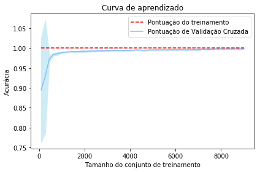


### Curva de aprendizado árvore de decisão


```python
CurvaAprend(DecisionTreeClassifier)
```


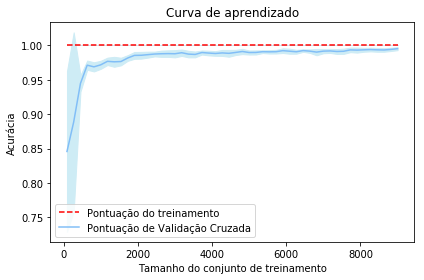


### Curva de aprendizado regressão logística


```python
CurvaAprend(LogisticRegression)
```


### Curva de aprendizado Naive Bayes


```python
CurvaAprend(GaussianNB)
```


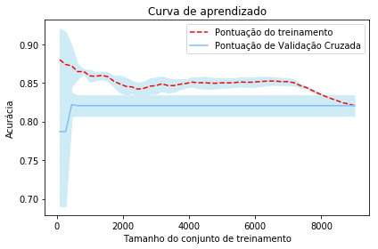


### Curva de aprendizado k-Nearest


```python
CurvaAprend(KNeighborsClassifier)
```


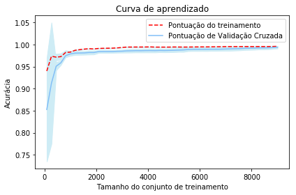


### Curva de aprendizado SVC


```python
CurvaAprend(SVC)
```


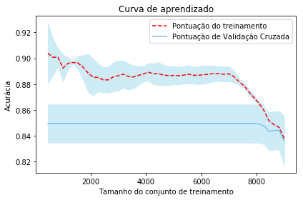


### Curva de aprendizado Análise Discriminante


```python
CurvaAprend(LinearDiscriminantAnalysis)
```


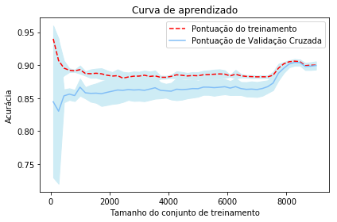


```python

```


```python

```


```python

```
